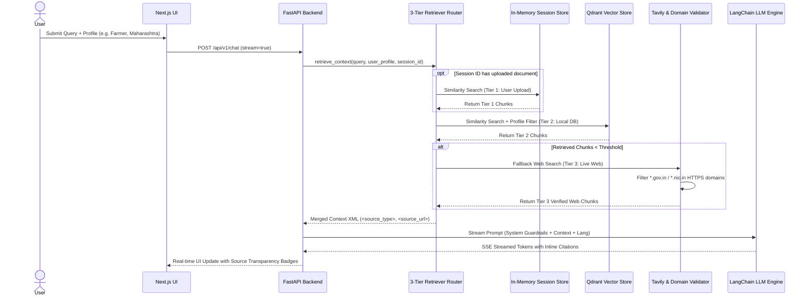

# 🇮🇳 JanMitra AI (जनमित्र) — AI Citizen Assistant for Government Schemes

> **Democratizing access to Indian Government Welfare Schemes through Zero-Hallucination, 3-Tier Retrieval-Augmented Generation (RAG), and Multi-lingual AI.**

---

## 📌 Executive Summary

**JanMitra AI** (जनमित्र - *Friend of the People*) is a production-grade, civic-focused Artificial Intelligence assistant designed to help Indian citizens—especially rural, underprivileged, and marginalized communities—discover, understand, and leverage official government welfare schemes (such as agricultural subsidies, healthcare assistance, educational scholarships, housing grants, and pensions).

Unlike generic AI chatbots that frequently output outdated or fabricated information, JanMitra AI is engineered as a **strict, high-trust civic system**. It grounds all answers strictly in verified government documents (`.gov.in`, `.nic.in`), provides inline citation URLs, transparently cites context sources, and strictly refuses to hallucinate when information is unavailable.

---

## 🎯 Vision & Ideology (Why JanMitra AI?)

### The Problem
India has thousands of welfare schemes launched by central and state governments. However, millions of eligible citizens miss out due to:
1. **Information Asymmetry:** Scheme guidelines are scattered across hundreds of dense, bureaucratic PDF documents and fragmented web portals.
2. **Language & Literacy Barriers:** Legal jargon and English-dominated documentation make it difficult for non-English speakers to understand eligibility criteria.
3. **AI Hallucinations in Civic Tech:** Generic commercial LLMs often confuse scheme rules, hallucinate eligibility criteria, or fabricate non-existent financial benefits, leading to citizen misinformation.

### Core Ideological Pillars

```
                        ┌─────────────────────────────────────────┐
                        │            JanMitra AI Core             │
                        └────────────────────┬────────────────────┘
                                             │
      ┌──────────────────────────────┬───────┴──────────────┬──────────────────────────────┐
      ▼                              ▼                      ▼                              ▼
┌──────────────┐             ┌──────────────┐       ┌──────────────┐               ┌──────────────┐
│  Zero        │             │  3-Tier      │       │ Strict Domain│               │ Multi-lingual│
│ Hallucination│             │  Retrieval   │       │  Validation  │               │ Accessibility│
└──────────────┘             └──────────────┘       └──────────────┘               └──────────────┘
```

1. **Zero Hallucination Guarantee:** If a user's question cannot be answered using official verified sources, JanMitra AI will explicitly state: *"I couldn't find this information on any verified official government website."*
2. **3-Tier Context Prioritization:** Respects the user's specific context first (e.g., uploaded rejection letters or notice PDFs), followed by the pre-indexed official schemes database, and finally live web fallback search.
3. **Strict Domain Whitelisting:** Live web fallbacks restrict results to verified government domains (`myscheme.gov.in`, `india.gov.in`, `pib.gov.in`, `*.gov.in`, `*.nic.in`). Blogs, news opinions, and forums (Reddit, Wikipedia) are aggressively filtered out.
4. **Data Privacy & Ephemeral Sessions:** User-uploaded documents remain in transient, in-memory vector stores attached to a session ID (`session_id`) and are never written to the public database or stored permanently.
5. **Multilingual Inclusivity:** Reads government documents in English, Hindi, or regional languages and seamlessly answers in the citizen's language of choice (Hindi, Marathi, Tamil, Bengali, English, etc.).

---

## 🏗 System Architecture & Workflow

JanMitra AI follows a clean, monorepo architecture built with Python (FastAPI) on the backend and Next.js (TypeScript) on the frontend.

```
                                  ┌───────────────────────────┐
                                  │   Next.js 14 App Router   │
                                  │   (TypeScript + Tailwind) │
                                  └─────────────┬─────────────┘
                                                │ REST / SSE Stream
                                                ▼
                                  ┌───────────────────────────┐
                                  │    FastAPI Backend API    │
                                  │     (Clean Architecture)  │
                                  └─────────────┬─────────────┘
                                                │
                                                ▼
                                  ┌───────────────────────────┐
                                  │  3-Tier Retriever Router  │
                                  └──────┬──────┬──────┬──────┘
                                         │      │      │
           ┌─────────────────────────────┘      │      └─────────────────────────────┐
           ▼                                    ▼                                    ▼
┌──────────────────────┐             ┌──────────────────────┐             ┌──────────────────────┐
│ Tier 1: User Doc     │             │ Tier 2: Qdrant DB    │             │ Tier 3: Tavily Web   │
│ In-Memory Store      │             │ Pre-indexed Schemes  │             │ Strict .gov.in Filter│
│ (FAISS / Temp Qdrant)│             │ + Profile Filtering  │             │ Live Fallback        │
└──────────────────────┘             └──────────────────────┘             └──────────────────────┘
                                                │
                                                ▼
                                  ┌───────────────────────────┐
                                  │   LangChain LLM Engine    │
                                  │ (Groq/OpenAI/Gemini/Ollama)│
                                  └───────────────────────────┘
```

### End-to-End Sequence Diagram



---

## 🔍 The 3-Tier Retrieval Strategy

When a user submits a query along with their demographic profile (e.g., *Farmer, Maharashtra, Annual Income < ₹2,00,000*), JanMitra AI evaluates context across three hierarchical tiers:

| Tier | Source | Scope & Lifetime | Description |
| :--- | :--- | :--- | :--- |
| **Tier 1 (Highest)** | **User-Uploaded Document** | Ephemeral (Session-scoped in-memory) | Parses user-uploaded PDFs/DOCX files (e.g. personal scheme application, land documents). |
| **Tier 2 (Primary)** | **Qdrant Vector Database** | Persistent (Pre-indexed Knowledge Base) | Vector similarity search across thousands of official scheme documents, pre-filtered with Qdrant metadata filters matching the user's demographic profile. |
| **Tier 3 (Fallback)** | **Tavily Live Web Search** | Dynamic (Live Official Web Search) | Triggered **only** when Tier 2 yields insufficient local documents. Restricted strictly to `.gov.in` and `.nic.in` domains. |

---

## 🛠 Technical Stack

### **Backend & AI Pipeline**
- **Framework:** FastAPI (Python 3.12+) with Pydantic v2 & `pydantic-settings`
- **RAG & Orchestration:** LangChain (LangChain Expression Language - LCEL)
- **Vector Database:** Qdrant (Production vector engine for persistent store & in-memory `:memory:` store for user sessions)
- **Embeddings:** `jinaai/jina-embeddings-v3` via `sentence-transformers` / `HuggingFaceEmbeddings`
- **LLM Support:** Multi-provider LLM Factory (`Groq`, `OpenAI`, `Google Gemini`, `Ollama`)
- **Live Search & Validation:** Tavily Search API + Custom `SourceValidator`
- **Chat History:** SQLite with LangChain `RunnableWithMessageHistory`

### **Frontend**
- **Framework:** Next.js 14 (App Router) + TypeScript
- **Styling:** Tailwind CSS + Shadcn UI + Lucide Icons + Framer Motion
- **Features:** Real-time Event Streaming (SSE), Interactive Profile Builder, Document Upload Drawer, Multilingual Switcher, Transparency Source Badges

### **Infrastructure & DevOps**
- **Containerization:** Docker & Docker Compose
- **Monorepo Structure:** Shared documentation, standardized environment configs, unified service orchestration

---

## 📂 Monorepo Folder Structure

```text
JanMitra AI/
├── backend/                        # Python FastAPI Backend
│   ├── app/
│   │   ├── api/                    # REST API Endpoints (v1)
│   │   │   └── v1/
│   │   │       └── endpoints/      # chat.py, ingest.py, schemes.py
│   │   ├── core/                   # Security, exceptions, pydantic settings (config.py)
│   │   ├── database/               # Qdrant client & vector store initialization
│   │   ├── ingestion/              # Document parser, PDF/HTML extractors, text cleaning
│   │   ├── llm/                    # LLM providers factory, system prompt builder, generator
│   │   ├── models/                 # Pydantic schemas (user profile, chat request/response)
│   │   ├── rag/                    # 3-Tier Retriever, metadata filter, source validator, temp_store
│   │   └── services/               # Tavily search integration
│   ├── Dockerfile
│   └── requirements.txt
├── frontend/                       # Next.js 14 Frontend Web Application
│   ├── src/
│   │   └── app/                    # App Router pages (chat, profile, schemes)
│   ├── Dockerfile
│   └── package.json
├── data/                           # Data storage directory for raw and processed documents
│   ├── raw/                        # Raw government scheme PDFs / HTML files
│   └── processed/                  # Parsed, cleaned text files
├── docs/                           # Architecture, design decisions, roadmap documentation
│   ├── architecture.md
│   ├── project_plan.md
│   ├── tavily_integration_design.md
│   └── user_document_integration_design.md
├── docker-compose.yml              # Unified multi-container setup
└── README.md                       # Comprehensive Project Overview (This file)
```

---

## ⚡ Quick Start Guide

### Prerequisites
- [Docker](https://www.docker.com/) & Docker Compose
- *Or for manual setup:* Python 3.12+ and Node.js 18+

---

### Option 1: Running with Docker Compose (Recommended)

1. **Clone the repository:**
   ```bash
   git clone https://github.com/YOUR_USERNAME/JanMitra-AI.git
   cd JanMitra-AI
   ```

2. **Configure Environment Variables:**
   Create a `.env` file inside the `backend/` directory based on `.env.example`:
   ```bash
   # backend/.env
   ENVIRONMENT=production
   PROJECT_NAME="JanMitra AI"
   
   # LLM Provider Keys (at least one required)
   GROQ_API_KEY=your_groq_api_key
   OPENAI_API_KEY=your_openai_api_key
   GEMINI_API_KEY=your_gemini_api_key
   
   # Qdrant Configuration
   QDRANT_URL=http://localhost:6333
   
   # Live Web Search (Fallback)
   TAVILY_API_KEY=your_tavily_api_key
   ```

3. **Spin up containers:**
   ```bash
   docker-compose up --build
   ```

4. **Access Applications:**
   - **Frontend App:** `http://localhost:3000`
   - **Backend OpenAPI Docs:** `http://localhost:8000/docs`

---

### Option 2: Local Development Setup

#### Backend Setup

1. Navigate to `backend/`:
   ```bash
   cd backend
   python -m venv venv
   source venv/bin/activate  # On Windows: venv\Scripts\activate
   pip install -r requirements.txt
   ```

2. Start the FastAPI backend:
   ```bash
   uvicorn app.main:app --reload --port 8000
   ```

#### Frontend Setup

1. Navigate to `frontend/`:
   ```bash
   cd frontend
   npm install
   ```

2. Start the Next.js development server:
   ```bash
   npm run dev
   ```
   Open `http://localhost:3000` in your browser.

---

## 🔑 Key Features & User Interface Highlights

- 🗣 **Multi-Lingual Assistant:** Seamless query resolution and translations across English, Hindi, Marathi, Tamil, Telugu, and more.
- 👤 **Demographic Profiling & Hard Filtering:** Filter search results based on user age, state of residence, occupation (e.g. Farmer, Student, Artisan), and income bracket.
- 📄 **Document Upload Integration:** Drag & drop official notices or personal scheme forms to ask context-specific questions.
- 🏷 **Transparent Citation Badges:** Every response explicitly tags whether information originated from **User Uploaded Document**, **Local Knowledge Base**, or **Live Official Government Web**.
- ⚡ **Real-Time SSE Response Streaming:** Instant token generation for smooth citizen interaction.

---

## 🛡 Security, Trust & Data Privacy

- **No Knowledge Base Poisoning:** User uploaded files are strictly contained within temporary in-memory collections and isolated per session ID.
- **Fail-Fast Configuration:** Environment variable validation via `pydantic-settings` ensures missing secret keys break startup cleanly rather than failing mid-request.
- **Strict HTTPS & Domain Verification:** Only verified government endpoints (`.gov.in`, `.nic.in`) are ingested or accessed via live web fallback.

---

## 📄 License & Attribution

Built with ❤️ for Indian Citizens. Distributed under the MIT License.
