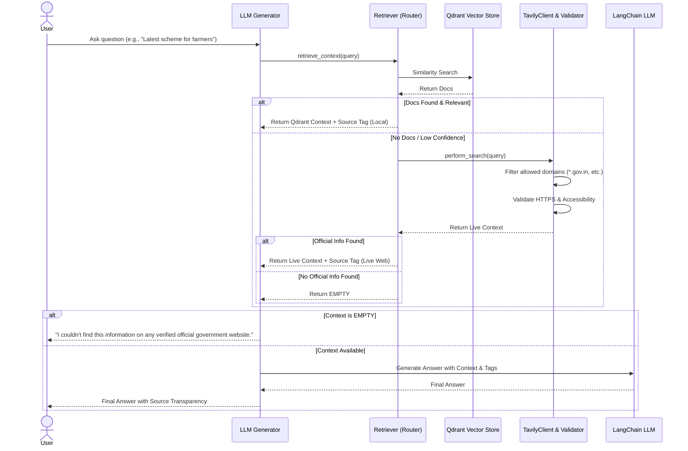

# Tavily Integration Architecture & Design Document

This document outlines the architecture for integrating the **Tavily Search API** into the AI Citizen Assistant as an intelligent fallback mechanism. The goal is to create a robust, production-ready system that adheres to SOLID principles and is easy to explain in software engineering placement interviews.

## 1. Core Objectives & Constraints

- **Primary Source:** Qdrant (Local Knowledge Base).
- **Fallback Source:** Tavily Search, triggered *only* when Qdrant yields no relevant documents or low confidence.
- **Strict Validation:** Restrict Tavily results to verified Indian government domains (`*.gov.in`, `pib.gov.in`, etc.). Reject blogs, forums, and unverified news.
- **Transparency:** The LLM's answer must explicitly state whether the information came from the "Local Knowledge Base" or a "Live Official Government Website".
- **Zero Hallucination:** If both Qdrant and Tavily fail to find information, respond with a strict failure message.

## 2. Updated Folder Structure

We will add a few focused modules without restructuring the whole project.

```text
backend/app/
├── core/
│   └── config.py               # Add TAVILY_API_KEY
├── llm/
│   └── generator.py            # Update to inject context source metadata
├── rag/
│   ├── retriever.py            # Update to orchestrate Qdrant vs. Tavily (ResponseRouter logic)
│   └── source_validator.py     # NEW: Validates URLs against allowed government domains
├── services/
│   └── tavily_client.py        # NEW: Wraps Tavily API, handles extraction & error handling
└── ...
```

## 3. Sequence Diagram



## 4. Key Design Decisions (For Interviews)

1. **Separation of Concerns (SoC):** We separate the search logic (`tavily_client.py`) from the validation logic (`source_validator.py`) and the routing logic (inside `retriever.py`). This makes unit testing significantly easier.
2. **Dependency Injection:** The `TavilyClient` relies on the `SourceValidator`. By injecting validation rules, we can easily change what domains are allowed without rewriting the search client.
3. **Fail-Fast & Strict Boundaries:** The `SourceValidator` aggressively strips out Wikipedia, Reddit, and blogs. In an era of AI hallucinations, bounding the model to high-trust domains is the most critical feature of a government/civic application.
4. **Stateless Fallback (Temporary Context):** By passing Tavily results directly to the LLM prompt without saving them to Qdrant, we prevent "knowledge base poisoning" (where incorrect live data permanently pollutes our vector DB). The optional Admin Approval pipeline is the right way to persist this data.
5. **Transparency by Design:** By explicitly wrapping context blocks with XML-like tags (`<source_type>Live Web</source_type>`), we force the LLM to acknowledge the origin of the data, which flows into the final user answer.

## 5. Next Implementation Steps

I will now write the implementation for these components in your repository:
1. `source_validator.py`
2. `tavily_client.py`
3. Update `config.py` & `retriever.py`
4. Update `generator.py` for routing.
