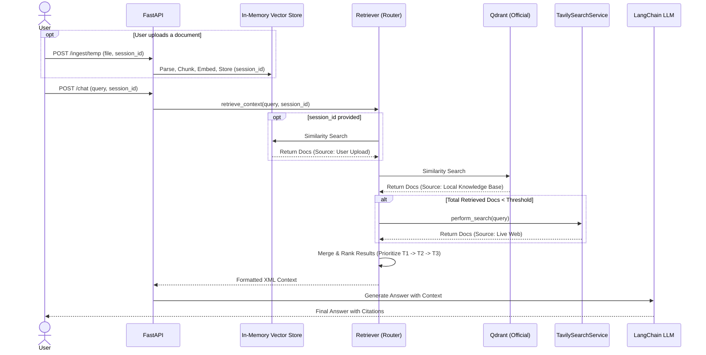

# User-Uploaded Document Integration Architecture

This document outlines the design for allowing users to optionally upload their own documents (PDF, DOCX, TXT) to the AI Citizen Assistant. This enhancement enables a **Three-Tier Retrieval Strategy** that prioritizes the user's specific context over general knowledge and live search.

## 1. Core Objectives & Constraints

- **Three-Tier Retrieval Priority:** 
  1. User-uploaded document (Highest Priority)
  2. Qdrant Local Knowledge Base (Pre-indexed schemes)
  3. Tavily Live Web Search (Fallback)
- **Temporary State:** User documents are stored in an in-memory vector store (ephemeral) tied to a `session_id`. They do not permanently pollute the official Qdrant database.
- **Transparency:** The LLM must explicitly cite whether information came from the `User Uploaded Document`, `Local Knowledge Base`, or `Live Web`.
- **Reusability:** We reuse the existing `IngestionPipeline`, `Chunker`, and `get_embedding_model` to process the temporary documents.

## 2. Updated Architecture & Folder Structure

```text
backend/app/
├── api/v1/endpoints/
│   ├── chat.py                 # Updated to accept session_id
│   └── ingest.py               # NEW ENDPOINT: /ingest/temp for session documents
├── rag/
│   ├── retriever.py            # Updated to route across 3 tiers (User -> Local -> Live)
│   └── temp_store.py           # NEW: In-Memory Qdrant or FAISS for session docs
└── ...
```

## 3. Retrieval Flow (Sequence Diagram)



## 4. Key Design Decisions (For Interviews)

1. **In-Memory Ephemeral Storage:** Instead of mixing user documents with official government schemes in Qdrant, we instantiate an in-memory vector store (like FAISS or a transient Qdrant instance) mapped to a `session_id`. This prevents cross-user data leakage and ensures official data remains pristine.
2. **Sequential Fallback vs. Parallel Merge:** We retrieve from the active tiers (Temp Store, then Qdrant). If the combined document count is insufficient to answer the query, we trigger Tavily. Finally, all retrieved documents are combined into a single context prompt, sorted by priority tier so the LLM pays the most attention to the user's specific document.
3. **Reusability of Components:** We rely on the exact same `PyMuPDFLoader`, `RecursiveCharacterTextSplitter`, and HuggingFace Embeddings. The only difference is the *destination* of the chunks. This demonstrates the **Open/Closed Principle** (extending behavior without modifying existing pipeline logic).
4. **Prompt Engineering for Transparency:** By extending our XML-style tags, the LLM now natively understands `<source_type>User Uploaded Document</source_type>`. This satisfies the transparency requirement and prevents hallucination.

## 5. Implementation Plan

1. **`temp_store.py`**: Create an in-memory store manager using Langchain's FAISS or in-memory Qdrant to hold `session_id` mapped collections.
2. **`ingest.py`**: Add an endpoint `/temp` to handle file uploads, process them, and insert them into the `temp_store`.
3. **`retriever.py`**: Update `retrieve_documents` to query the `temp_store` (if `session_id` is present), then Qdrant. If both yield poor results, fallback to Tavily. Combine and format.
4. **`chat.py` & `generator.py`**: Accept `session_id` in the request and pass it down.
5. **`prompts.py`**: Update instructions to accommodate the new "User Uploaded Document" source type.
